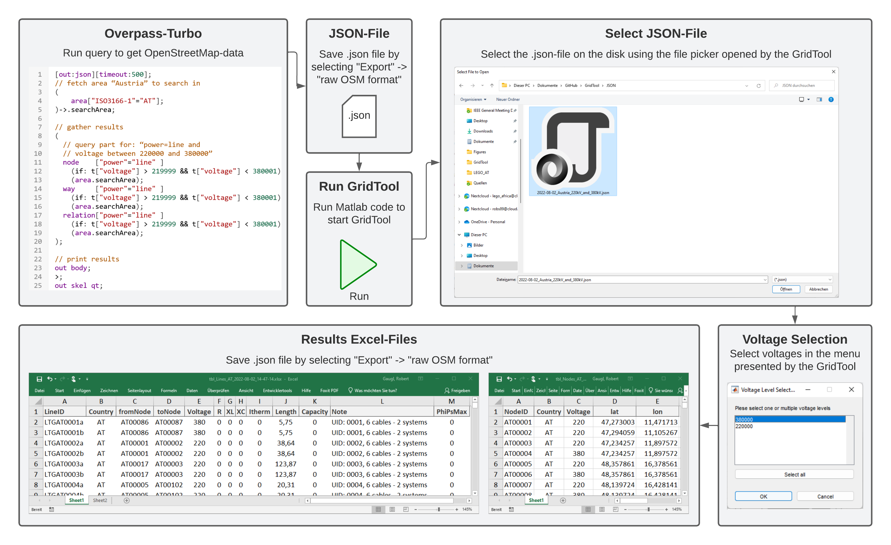

# GridTool
Open-source tool to convert OpenStreetMap electricity grid data for use in energy simulation models (ESMs).

GridTool is an easy-to-use tool to convert and simplify electricity grid data from OpenStreetMap (https://www.openstreetmap.org/) for the use in energy simulation models (ESMs). Instead of relying on relations between lines and power stations (that are often missing) in the OpenStreetMap-data, the tool uses a heuristic approach to identify grid nodes and simplifying the data.

The GridTool shortens the lengthy process of converting and simplyfying electricity grid data from transmission and distribution system operators (TSOs and DSOs) for the use in ESMs to mere seconds.

The tool is programmed in MATLAB and the main advantages are its flexibility and easy customizability. The final results are two Excel files. One contains the nodes (power stations) and the second one contains the lines.

## Software Architecture
GridTool is split into 6 modules that itself are divided into 24 functions to ensure clarity, maintainability and easy expandability. A flowchart showing the 6 modules and 24 functions can be seen below. A detailed description of the functionality of these functions can be found in [1] as well as in the comments of the MATLAB code itself.

## System Requirements
* PC with MATLAB version R2021a installed and a valid licence (GridTool is programmed in a way that it should be compatible with older and newer versions, but it is not tested with other MATLAB versions.)

## How to run the GridTool
This provides a step-by-step instruction on how to run the GridTool. The steps are also visualized in the figure below.
1) Download the GridTool.m file on a PC that meets the system requirements.
2) Download the electricity grid data from OpenStreetMap using the OverpassTurbo-website (https://overpass-turbo.eu/). An example of a query to download Austria's electricity grid lines between 220 kV and 380 kV can be found in the file *OverpassTurbo_Example_Query.txt*. Run the query in OverpassTurbo and export  the result as "Raw OSM data", which downloads the data in the json file format. For testing purposes you can also use the *2022-08-02_Austria_220kV_and_380kV.json* file provided in the repository.
3) Open the GridTool.m file in Matlab.
4) Adjust the settings in the *Initialization and Settings* section of the code.
5) Run the code by clicking the "Run"-button or pressing "F5".
4) A file window opens to select the previously downloaded json file.
5) After a few seconds, a new window pops up to select the desired voltage levels. Multiple voltage levels can be selected by holding the "Alt" key.
6) The GridTool is completed, when it displays "GOOD BYE" in the MATLAB console. The final files can be found in the folder where the GridTool.m file is saved.

## Illustrative Example: Austrian Transmission Grid
In the figure below is a comparison between the official grid map from the Austrian transmission system operator APG (Downloaded: August 3th, 2022) and the result of the GridTool (data downloaded from OpenStreetMap: August 2nd, 2022). To run this illustrative example, you can use the *2022-08-02_Austria_220kV_and_380kV.json* file with the GridTool.

# References
[1] MISSING
